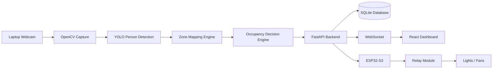
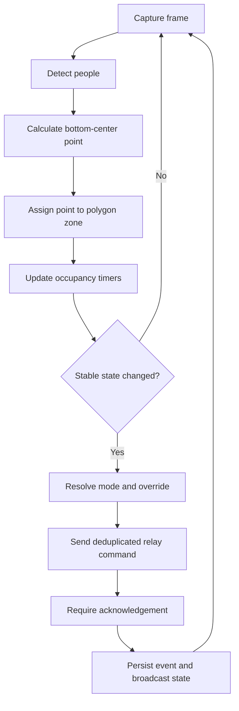

# Visualec

**AI-powered vision-based adaptive grid energy management**

Visualec watches a room through a laptop webcam, assigns detected people to normalized spatial zones using each bounding box's bottom-center point, and powers only the appliances mapped to occupied zones. A FastAPI control plane streams live state to a responsive React dashboard and talks to an ESP32-S3 relay controller over acknowledged HTTP commands.

The application operates only from physical inputs: a real webcam supplies frames, YOLO performs live inference, and relay state changes require an acknowledgement from the configured ESP32-S3. Missing hardware is reported as offline and never replaced with generated data.

## Why Visualec

Conventional room automation treats a room as one switchable block. Visualec divides it into independently controlled zones, applies activation/deactivation persistence to suppress relay chatter, preserves temporary manual overrides, and records state transitions for energy estimates and auditability.

## Features

- Laptop webcam capture with automatic reconnect, health, resolution selection, FPS, and MJPEG output
- CPU-compatible YOLO person detection with lazy model loading, frame skipping, confidence controls, and bottom-center zone assignment
- Polygon/rectangle zones with normalized coordinates, editable colors, names, relay mappings, and auto-control flags
- Occupancy guards: 1-second activation and 10-second deactivation defaults
- Automatic, manual, hybrid, and emergency modes
- Relay command acknowledgement, retry, timeout, duplicate suppression, temporary overrides, and all-off safety path
- Live dashboard, visual zone editor, energy analytics, CSV export, event log, settings, and responsive mobile navigation
- SQLite persistence behind SQLAlchemy models, with a migration-friendly data access boundary
- Complete ESP32-S3 Arduino firmware for active-LOW or active-HIGH relay boards

## Architecture





## Repository layout

```text
backend/    FastAPI API, CV runtime, persistence, tests
frontend/   React + TypeScript dashboard
firmware/   ESP32-S3 Arduino firmware
docs/       Architecture, API, wiring, testing, deployment
scripts/    Cross-platform local setup/run helpers
```

## Requirements

- Python 3.11–3.13 recommended (3.14 works for the core stack, but some ML wheels may lag)
- Node.js 20+
- Physical webcam
- ESP32-S3 and relay module on the same network
- Arduino IDE 2.x for firmware

## Quick start — physical hardware

### 1. Backend

```powershell
cd backend
python -m venv .venv
.venv\Scripts\Activate.ps1
pip install -r requirements.txt
Copy-Item .env.example .env
uvicorn app.main:app --reload
```

Set `CAMERA_INDEX` and `ESP32_BASE_URL` in `backend/.env` for the connected devices. The first YOLO run may download `yolov8n.pt`; inference remains offline until compatible Ultralytics and PyTorch packages plus model weights are available.

### 2. Frontend

```powershell
cd frontend
Copy-Item .env.example .env
npm install
npm run dev
```

Open `http://localhost:5173`. API documentation is at `http://localhost:8000/docs`.

### Phase 1 single-command prototype

From `backend`, run `python run_phase1.py`. It opens the physical webcam, draws three zones, detects people, applies persistence delays, and writes live occupancy transitions to the terminal. Press `q` to exit.

## Physical hardware mode

1. Flash the firmware in `firmware/visualec_esp32_s3` after setting Wi-Fi credentials.
2. Confirm `GET http://<device-ip>/health` and relay OFF state.
3. In `backend/.env`, set `ESP32_BASE_URL` to the physical controller address or mDNS hostname.
4. Restart the backend and test each low-voltage load from the dashboard before enabling automatic mode.

See [wiring guide](docs/wiring-guide.md) and [deployment guide](docs/deployment-guide.md).

## Configuration

All network addresses, thresholds, camera settings, timing rules, tariffs, and hardware switches are environment-driven. Copy the `.env.example` file in each application; never commit real passwords or device credentials. Relay/zone mappings and wattages live in SQLite and are editable through the API/dashboard.

## Testing

```powershell
cd backend
pytest -q
cd ..\frontend
npm run build
```

The full real-device checklist, camera guidance, acknowledgement checks, and failure tests are in [testing guide](docs/testing-guide.md).

## Safety

Use low-voltage DC loads during prototyping. Never put mains voltage on a breadboard. Use a properly rated, enclosed relay/contactor assembly installed by a qualified electrician, keep AC wiring physically isolated from USB/logic wiring, add fusing and strain relief, and disconnect power before changing connections. Software safety behavior is supplementary and is not a substitute for compliant electrical protection.

## Troubleshooting

- **Camera offline:** close other apps using the webcam, confirm `CAMERA_INDEX`, then restart capture. The backend retries automatically without manufacturing replacement frames.
- **YOLO unavailable:** install compatible `ultralytics`/PyTorch wheels or use Python 3.12. The rest of the system remains operational.
- **ESP32 offline:** confirm laptop/device are on the same network, verify `/health`, firewall rules, and `ESP32_BASE_URL`.
- **Relay logic inverted:** change `RELAY_ACTIVE_LOW` in firmware and reflash with loads disconnected.
- **Dashboard reconnecting:** confirm port 8000, CORS origins, and `VITE_WS_URL`.

## Scaling plan

Replace SQLite with PostgreSQL via `DATABASE_URL`, move frames/events to a broker-backed worker, use MQTT for multiple controllers, add authenticated roles and TLS, persist calibration versions, ingest physical power sensors for calibrated energy data, and deploy detector workers near cameras while retaining the same REST/WebSocket contracts.
